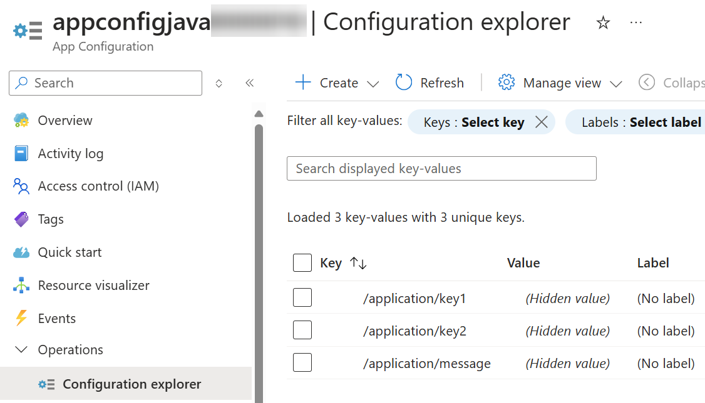
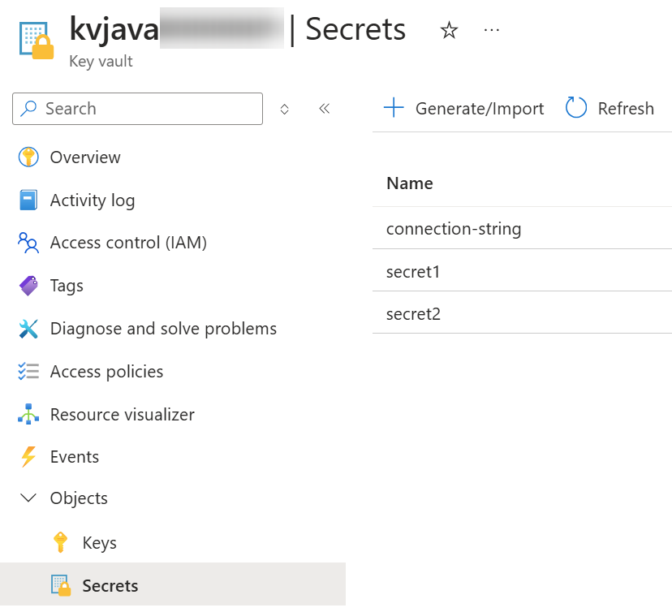
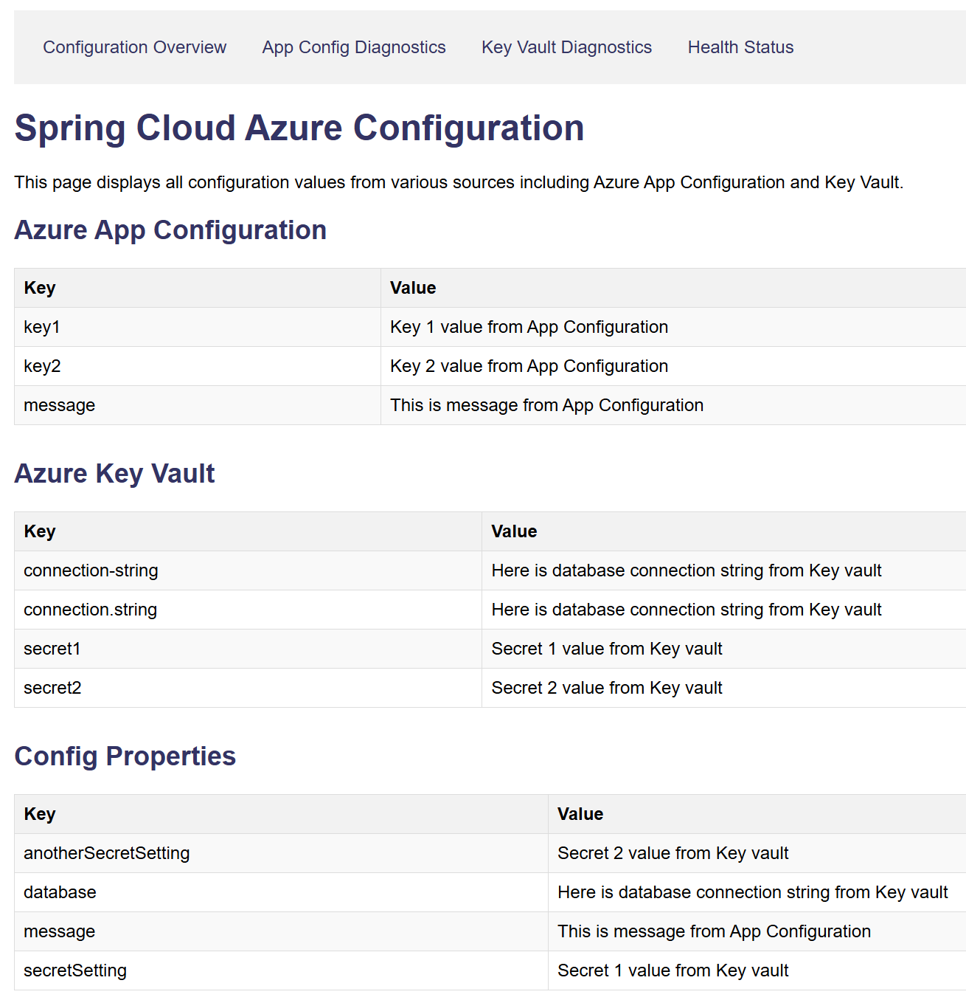

# Azure Sprint Boot - Configuration application

## Links

[What is Spring Cloud Azure - learn.microsoft.com](https://learn.microsoft.com/en-us/azure/developer/java/spring-framework/spring-cloud-azure-overview)

[What is Spring Cloud Azure? - spring.io](https://spring.io/projects/spring-cloud-azure)

[Spring Cloud Azure configuration properties](https://learn.microsoft.com/en-us/azure/developer/java/spring-framework/configuration-properties-all)

[Spring Cloud Azure Samples](https://github.com/Azure-Samples/azure-spring-boot-samples)

[Spring Cloud Azure > App configuration support](https://learn.microsoft.com/en-us/azure/developer/java/spring-framework/app-configuration-support?tabs=azure-ad)

[Spring Cloud for Azure starter App Configuration client library for Java](https://learn.microsoft.com/en-us/java/api/overview/azure/spring-cloud-starter-appconfiguration-config-readme?view=azure-java-stable)

[Maven in 5 Minutes](https://maven.apache.org/guides/getting-started/maven-in-five-minutes.html)

## Configuration application

Application fetches 
[Azure App Configuration](https://learn.microsoft.com/en-us/azure/azure-app-configuration/overview)
and
[Azure Key Vault](https://learn.microsoft.com/en-us/azure/key-vault/general/overview)
configuration values and shows them in the user interface.

Here is the app configuration setup:



Here is the key vault setup:



Run the demo application:

```powershell
# Set connection parameters:
# 1) Use this with managed identity
$env:APP_CONFIGURATION_ENDPOINT="https://<youraccount>.azconfig.io/"
# 2) Use this with connection string including secret
$env:APP_CONFIGURATION_CONNECTION_STRING="Endpoint=https://<youraccount>.azconfig.io;Id=<value>;Secret=<secret>"

$env:KEY_VAULT_ENDPOINT="https://<youraccount>.vault.azure.net/"

.\run-app.bat
```

Note: Due to
[Issue #37969](https://github.com/Azure/azure-sdk-for-java/issues/37969),
local development for App Configuration requires using either key-based authentication
or then implement Client Builder Customization as described in the GitHub issue.

Open browser to the following address:

```
http://localhost:8080/
```

You should now see the above values in your app:



Health endpoint displays the following output from `http://localhost:8080/actuator/health`:

```json
{
  "status": "UP",
  "components": {
    "appConfig": {
      "status": "UP",
      "details": {
        "status": "App Configuration connection successful",
        "endpoint": "https://<youraccount>.azconfig.io",
        "hasSettings": true
      }
    },
    "discoveryComposite": {
      "description": "Discovery Client not initialized",
      "status": "UNKNOWN",
      "components": {
        "discoveryClient": {
          "description": "Discovery Client not initialized",
          "status": "UNKNOWN"
        }
      }
    },
    "diskSpace": {
      "status": "UP",
      "details": {
        "total": 1021771247616,
        "free": 749229944832,
        "threshold": 10485760,
        "path": "C:\\GitHub\\java-examples\\azure-spring-boot-examples\\configuration-application\\.",
        "exists": true
      }
    },
    "keyVault": {
      "status": "UP",
      "details": {
        "status": "Key Vault connection successful",
        "vaultUrl": "https://<youraccount>.vault.azure.net/"
      }
    },
    "ping": {
      "status": "UP"
    },
    "refreshScope": {
      "status": "UP"
    },
    "ssl": {
      "status": "UP",
      "details": {
        "validChains": [],
        "invalidChains": []
      }
    }
  }
}
```

The key configuration points can be found from 
[bootstrap.yml](./src/main/resources/bootstrap.yml)

